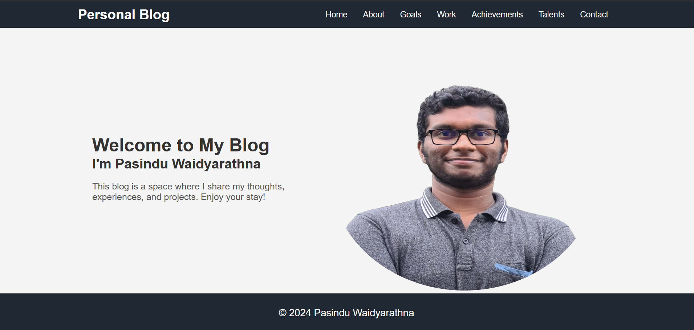
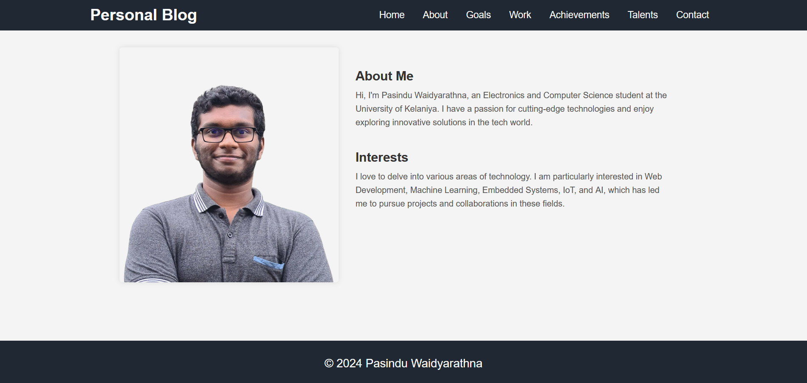
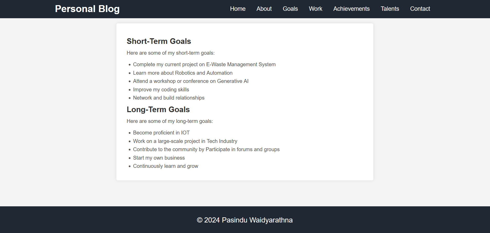
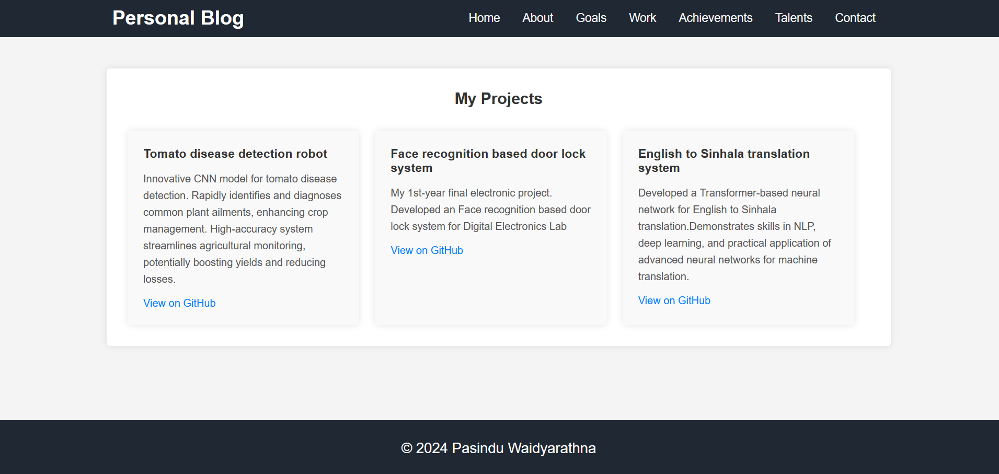
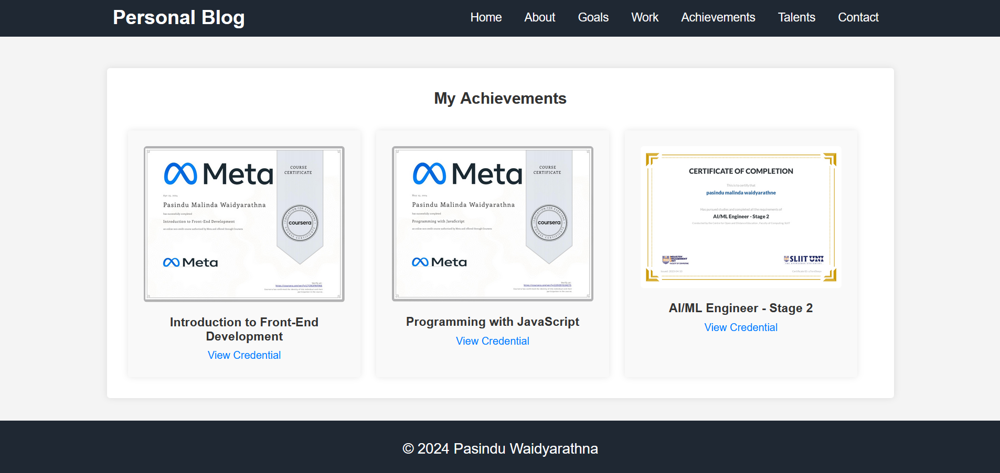
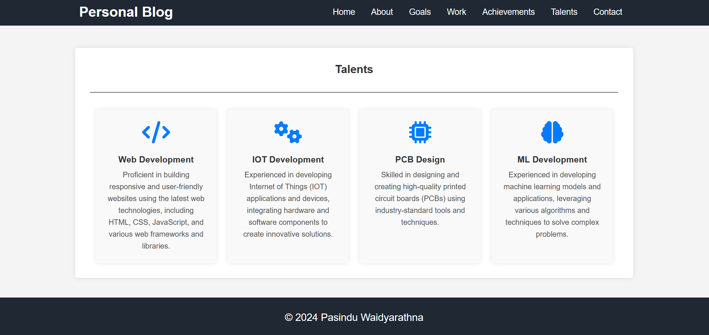
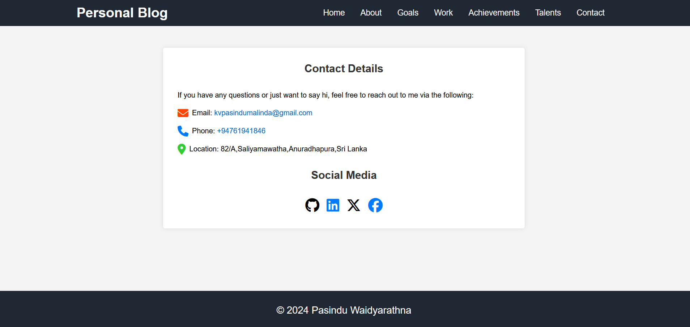

# Portfolio
Welcome to my personal portfolio website, a project developed using HTML and CSS to showcase my professional journey and personal interests. This website includes several key sections:

Home Page

About Page

Goal Page

Work Page

Achievement Page

Talent Page

Contact Page

Feel free to explore the code and the live demo to see how each section is implemented and designed. This project is a testament to my skills in web development and my dedication to personal and professional growth.
